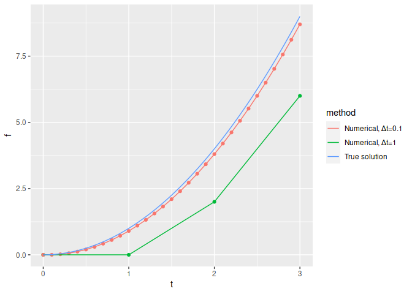
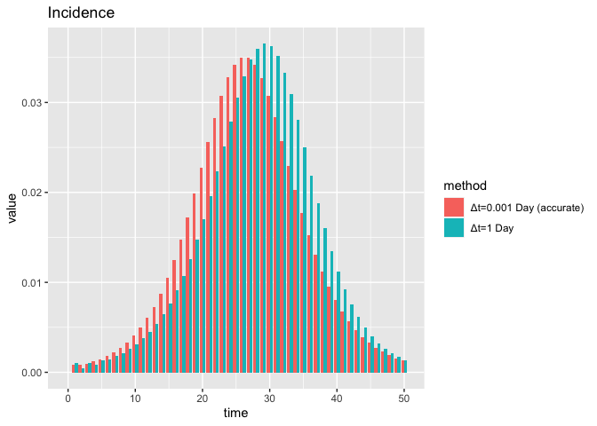
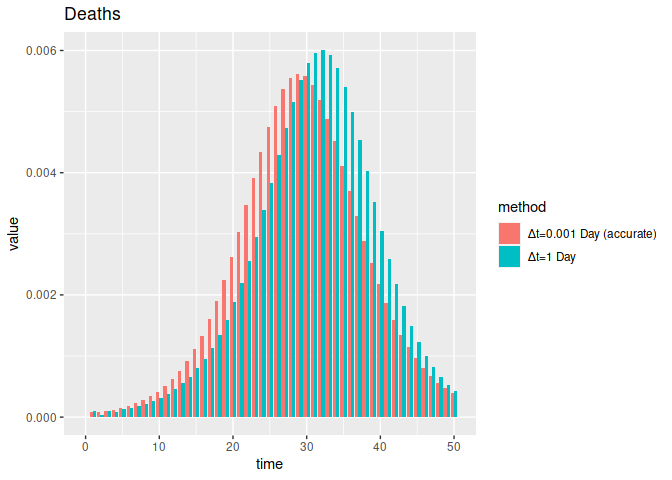
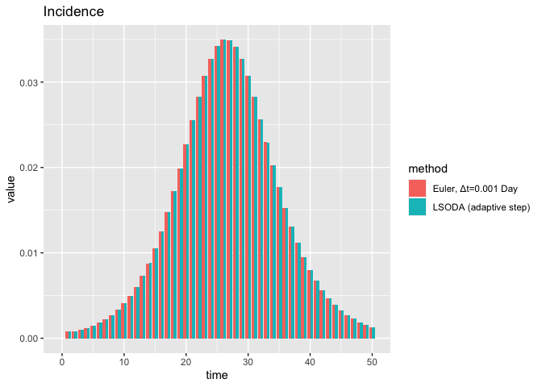
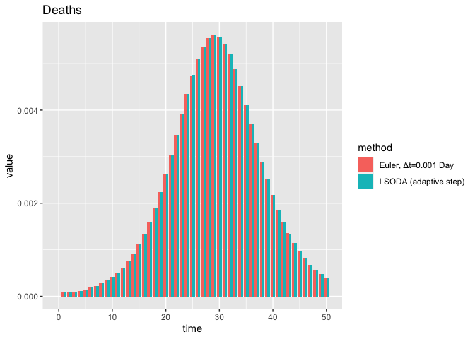

Numerical solution of SEIRD
================

``` r
library(comomodels)
library(deSolve)
library(ggplot2)
library(tidyverse)
#> ── Attaching packages ─────────────────────────────────────── tidyverse 1.3.1 ──
#> ✓ tibble  3.1.5     ✓ dplyr   1.0.7
#> ✓ tidyr   1.1.4     ✓ stringr 1.4.0
#> ✓ readr   2.0.2     ✓ forcats 0.5.1
#> ✓ purrr   0.3.4
#> ── Conflicts ────────────────────────────────────────── tidyverse_conflicts() ──
#> x dplyr::filter() masks stats::filter()
#> x dplyr::lag()    masks stats::lag()
library(glue)
#> 
#> Attaching package: 'glue'
#> The following object is masked from 'package:dplyr':
#> 
#>     collapse
```

## Introduction

Compartmental epidemiological models (such as SEIRD and its variants)
are *differential equation* models—that is, given particular values of
the model parameters, the models do not directly specify a functional
form over time, but rather they specify the instantaneous rate of change
of the system, forming a system of differential equations whose solution
is the model output over time. Like many differential equation models of
interest in scientific applications, SEIRD differential equations do not
admit analytical solutions. Instead, an approximation of the solution
must be obtained using numerical methods.

Epidemiological differential equations can be solved easily using simple
fixed time step solver such as the Euler method. In this notebook, we
show that when such methods are employed without sufficient care in the
selection of the time step, high error in the numerical solution may
occur. We recommend more sophisticated adaptive step size solvers when
solving SEIRD-type models, as implemented in the
[comomodels](https://github.com/Como-DTC-Collaboration/como-models)
package.

This notebook begins with a review of a simple differential equation
solver on a toy problem with a known solution. Then, it demonstrates the
importance of accurate ODE solvers for comomodel’s SEIRD model.

## Numerical solution of a differential equation using forward Euler

One of the simplest numerical solvers for differential equations is the
forward Euler method. This method assumes a first order differential
equation

$$\\frac{df}{dt} = g(t, f)$$

(note that *f* may be a vector-valued function), as well as an initial
condition *f*(*t*=*t*<sub>0</sub>). Forward Euler forms an approximate
solution {*f*<sub>*i*</sub>}<sub>*i* = 0</sub><sup>*N*</sup> on a set of
time points
{*t*<sub>*i*</sub> = *t*<sub>0</sub> + *i**Δ**t*}<sub>*i* = 0</sub><sup>*N*</sup>
which is given by:

*f*<sub>0</sub> = *f*(*t*=*t*<sub>0</sub>);
*f*<sub>*i* + 1</sub> = *f*<sub>*i*</sub> + *g*(*t*<sub>*i*</sub>,*f*<sub>*i*</sub>)*Δ**t*,    *i* = 1, …, *N* − 1.

### Importance of the solver step size

Note that *Δ**t*—the time spacing between adjacent values in the
approximate solution—is a critical parameter of the Euler method. While
calculating the next function value *f*<sub>*i* + 1</sub>, the Euler
method approximates the derivative *g*(*t*,*f*) with the constant value
*g*(*t*<sub>*i*</sub>,*f*<sub>*i*</sub>) for the interval
(*t*<sub>*i*</sub>,*t*<sub>*i*</sub>+*Δ**t*). However, in actuality,
*g*(*t*,*f*) presumably varies over time—thus, as *Δ**t* is allowed to
get larger, the approximation of *g*(*t*,*f*) by a constant value on an
interval of width *Δ**t* becomes more prone to error, which ultimately
accumulates in the approximate solution and causes it to deviate from
the true values.

However, obtaining a satisfactory solution to the differential equation
is not as simple as setting *Δ**t* to some minuscule value, as
decreasing the value of *Δ**t* will cause the runtime of the method to
increase, and for very small values of *Δ**t*, the runtime may be
prohibitive.

### Effect of solver step size on solutions

Before looking at the epidemiological model, we examine the numerical
error arising from the solver step size in a simple model for which we
have an analytical solution. The differential equation is:

$$\\frac{df}{dt} = 2t;\\;\\;\\;\\; f(t=0)=0$$

We solve this differential equation on the interval from *t* = 0 to
*t* = 3 with two different choices of the time step (*Δ**t* = 1 and
*Δ**t* = 0.1). We compare the obtained approximate solutions with the
known true solution.

``` r
rhs <- function(t, state, params){
  list(2*t)
}

true_solution <- function(t){
  t ^ 2
}


sparse_times <- seq(0, 3, by=1)
dense_times <- seq(0, 3, by=0.1)


# Solve using "euler" from deSolve
# It uses the same times on which output is requested as the solver time points
numerical_solution_sparse = ode(
  y=0,
  times=sparse_times,
  parms=NULL,
  func=rhs,
  method="euler",
)

numerical_solution_dense = ode(
  y=0,
  times=dense_times,
  parms=NULL,
  func=rhs,
  method="euler",
)


# Save the results in data frames for plotting
results_sparse <- data.frame(
  t=numerical_solution_sparse[,1],
  f=numerical_solution_sparse[,2],
  method="Numerical, Δt=1"
)

results_dense <- data.frame(
  t=numerical_solution_dense[,1],
  f=numerical_solution_dense[,2],
  method="Numerical, Δt=0.1"
)

results_true <- data.frame(
  t=seq(0, 3, by=0.01),
  f=true_solution(seq(0, 3, by=0.01)),
  method="True solution"
)


ggplot() +
  geom_point(data=rbind(results_sparse, results_dense),
             aes(x=t, y=f, color=method),
             show.legend=F) +
  geom_line(data=rbind(results_sparse, results_dense, results_true),
            aes(x=t, y=f, color=method))
```

<!-- -->

We observe that the large step size of *Δ**t* = 1 causes significant
inaccuracy in the solution. In particular, because the derivative is
increasing over time, the forward Euler method (which, between solver
time steps, assumes that the derivative remains constant at an old
value) produces an approximate solution that is too low. For the smaller
time step *Δ**t* = 0.1, the approximate solution is more accurate,
although a negative deviation is still apparent.

## Effect of solver step size on the SEIRD model

First, we load the SEIRD model from comomodels, and specify plausible
parameter values and initial conditions.

``` r
model <- comomodels::SEIRD()
transmission_parameters(model) <- list(beta=1.0, kappa=0.9, gamma=0.5, mu=0.1)
initial_conditions(model) <- list(S0=0.999, E0=0, I0=0.001, R0=0)
```

Next, we run the model using the forward Euler method. We investigate
two different choices for the solver step size. The first is a daily
time step, which naively might be considered an acceptable default
choice, given that we are interested in simulating daily cases and
deaths. We also consider a much smaller time step of 0.001 days, for
which we know that the solution is sufficiently accurate (see the
following section for further details on obtaining accurate numerical
solutions).

``` r
times_daily <- seq(0, 50, by=1)
solution_daily <- run(model, times_daily, solve_method="euler")
changes_daily <- solution_daily$changes

times_dense <- seq(0, 50, by=0.001)
solution_dense <- run(model, times_dense, solve_method="euler")
df <- solution_dense$changes
df <- as.data.frame(df)

# Sum the deaths and incidences from the dense output to obtain daily values
changes_dense <- data.frame(time=NULL, value=NULL, compartment=NULL)
for (t in times_daily) {
  cases <- subset(df, t-1<df[,1] & df[,1]<=t)
  incidence <- subset(cases, cases[,3]=="Incidence")
  death <- subset(cases, cases[,3]=="Deaths")
  changes_dense <- rbind(changes_dense, 
                         data.frame(time=t, 
                                    value=sum(incidence$value), 
                                    compartment="Incidence", 
                                    age_range="0-150"))
  changes_dense <- rbind(changes_dense, 
                         data.frame(time=t, 
                                    value=sum(death$value), 
                                    compartment="Deaths", 
                                    age_range="0-150"))
}

# Reorder the deaths and incidences
changes_dense <- changes_dense[order(changes_dense$compartment, changes_dense$time),]

# Save the labels and combine for plotting
changes_dense$method <- "Δt=0.001 Day (accurate)"
changes_daily$method <- "Δt=1 Day"
all_changes <- rbind(changes_dense, changes_daily)


ggplot(subset(all_changes, all_changes[,3]=="Incidence"), 
       aes(x = time, y = value, fill = method)) +
  geom_bar(stat="identity", position = position_dodge()) +
  labs(title="Incidence")
```

<!-- -->

``` r
ggplot(subset(all_changes, all_changes[,3]=="Deaths"), 
       aes(x = time, y = value, fill = method)) +
  geom_bar(stat="identity", position = position_dodge()) +
  labs(title="Deaths")
```

<!-- -->
These results indicate that for the SEIRD model with these parameters, a
daily step size is much too large to obtain accurate results. The daily
step size causes the date of the peak of the epidemic (for both incident
cases and deaths) to be overestimated by several days.

## Differential equations versus difference equations

The forward Euler recurrence relation defining the approximate solution
to a *differential* equation,

*f*<sub>*i* + 1</sub> = *f*<sub>*i*</sub> + *Δ**t**g*(*t*<sub>*i*</sub>,*f*<sub>*i*</sub>),

is identical with a typical definition of a *difference* equation of the
sort used in multiple fields of computational biology, including
epidemiology.

Thus, what we have up till now treated as numerical error arising from
the forward Euler method may alternatively be viewed as the discrepancy
between an (accurately solved) differential equation model and a
corresponding difference equation model. The results above show, for the
parameter values considered, that this discrepancy is not negligible.
While difference equations can be valid and tenable models for certain
phenomena, we see that a daily SEIRD difference equation cannot be
considered equivalent to the original SEIRD differential equation model,
that is, the same parameter values can cause substantially different
outputs from each model.

## Adaptive step size methods

The chief advantage of numerical solvers such as forward Euler described
above, which take a fixed grid of time points on which to calculate the
approximate solution, is their ease of implementation. However, as seen
above, these methods suffer because:

1.  To obtain an accurate solution, the solver step size must be set to
    some small value, but it is often unknown how small this value must
    be.
2.  When the solver step size is set to a small value, the method may be
    unpleasantly slow.

Both of these defects are addressed by adaptive step size methods. In
these, the user specifies not a step size but a *tolerance*—some
relative or absolute number which the local error in the approximate
solution should not exceed. Then, the solver algorithm selects the
appropriate step size in order for the solution to meet this tolerance.
Adaptive solvers are able to vary the step size over the course of the
solve, selecting very small values only in those regions of time where
this is necessary, and otherwise increasing the step size to larger
values. For this reason, they are much more efficient than fixed step
solvers.

A wide variety of approaches to step size adaptation have been proposed.
At each step, these methods typically use some heuristic to estimate the
error introduced at that time step, and then select roughly the largest
possible step such that the threshold imposed by the user-supplied
tolerance is not exceeded.

Although adaptive step size solvers are challenging to implement, it is
often possible to rely on existing implementations. In R, a wide
selection of adaptive step size solvers are provided by the deSolve
package. The comomodels library uses deSolve to handle numerical
solution of the systems of ODEs that arise in compartmental epidemiology
models, giving users easy access to efficient adaptive step size
solvers. In comomodels, default values of the local error tolerances are
used, so these need not be specified manually. The default solver used
in comomodels is LSODA (Hindmarsh and Petzold 2005). This method
automatically switches between the Adams and backward differentiation
formula (BDF) solvers (Gautschi 2012) based on the properties of the
differential equation being solved.

In the following example, we compare the performance of the forward
Euler solver with a fixed, small step size to that of the LSODA adaptive
step size solver.

``` r
times_dense <- seq(0, 50, by=0.001)
print("Timing for Euler (fixed step):")
#> [1] "Timing for Euler (fixed step):"
ptm <- proc.time()
solution_dense <- run(model, times_dense, solve_method='euler')
proc.time() - ptm
#>    user  system elapsed 
#>   0.955   0.000   0.955

times_daily <- seq(0, 50, by=1)
print("Timing for LSODA (adaptive step):")
#> [1] "Timing for LSODA (adaptive step):"
ptm <- proc.time()
solution_adapt <- run(model, times_daily, solve_method='lsoda')
proc.time() - ptm
#>    user  system elapsed 
#>   0.005   0.000   0.005

df <- solution_dense$changes
df <- as.data.frame(df)

# Sum the deaths and incidences from the dense output to obtain daily values
changes_dense <- data.frame(time=NULL, value=NULL, compartment=NULL)
for (t in times_daily) {
  cases = subset(df, t-1<df[,1] & df[,1]<=t)
  incidence = subset(cases, cases[,3]=="Incidence")
  death = subset(cases, cases[,3]=="Deaths")
  changes_dense = rbind(changes_dense, 
                        data.frame(time=t,
                                   value=sum(incidence$value),
                                   compartment="Incidence",
                                   age_range="0-150"))
  changes_dense = rbind(changes_dense,
                        data.frame(time=t,
                                   value=sum(death$value),
                                   compartment="Deaths",
                                   age_range="0-150"))
}

# Save the labels and combine for plotting
changes_adapt <- solution_adapt$changes
changes_dense$method <- "Euler, Δt=0.001 Day"
changes_adapt$method <- "LSODA (adaptive step)"
all_changes <- rbind(changes_dense, changes_adapt)


ggplot(subset(all_changes, all_changes[,3]=="Incidence"), 
       aes(x = time, y = value, fill = method)) +
  geom_bar(stat="identity", position = position_dodge()) +
  labs(title="Incidence")
```

<!-- -->

``` r
ggplot(subset(all_changes, all_changes[,3]=="Deaths"), 
       aes(x = time, y = value, fill = method)) +
  geom_bar(stat="identity", position = position_dodge()) +
  labs(title="Deaths")
```

<!-- -->
Both methods achieve the same accurate solution. However, for the LSODA
solver, no fiddling with step sizes is necessary: we merely provide the
time points at which we want to access the solution (daily), and the
solver handles the selection of the step sizes. We also note the
significant speed advantage of the LSODA solver, which may be more than
50 times faster (the actual runtimes will be system dependent).

Adaptive solvers are not infallible. On highly challenging differential
equations, and when supplied with insufficient tolerances for the
simulation or inference task at hand, they may be responsible for errors
just as pernicious as those arising from fixed step solvers with too
large step sizes. However, for the simulation of compartmental
epidemiological models such as those covered by the comomodels package,
we highly recommend the use of adaptive solvers such as LSODA (the
default choice of solver in comomodels) for speed and accuracy.

## Discontinuities in the RHS (interventions)

Differential equations of the form

$$\\frac{df}{dt} = g(t, f)$$

where *g* is discontinuous present further challenges to both adaptive
and fixed step size methods, whose error properties (and, for adaptive
step size methods, the algorithms used to determine the time steps)
typically assume differentiability of *g*.

In the epidemiological models of the sort described by comomodels,
discontinuities of *g* in time are possible, most notably in the SEIRDV
model where step function interventions may be used to specify the rate
of vaccination.

Some of the numerical methods that can be used to increase efficiency
and decrease error in the case of discontinuous *g* are:

1.  Divide the time interval into sets where *g* is continuous, and
    solve the ODE on each set separately.
2.  Replace the discontinuous *g* with a smooth approximation, and use a
    standard solver.

The second approach is adopted by the SEIRDV model, as a tanh
approximation to the step function is used. Further details and a
general treatment may be found in (Stewart 2011), Chapter 8.

## References

<div id="refs" class="references csl-bib-body hanging-indent">

<div id="ref-gautschi2012numerical" class="csl-entry">

Gautschi, Walter. 2012. *Numerical Analysis*. Springer Science &
Business Media.

</div>

<div id="ref-hindmarsh2005lsoda" class="csl-entry">

Hindmarsh, AC, and LR Petzold. 2005. “LSODA, Ordinary Differential
Equation Solver for Stiff or Non-Stiff System.”

</div>

<div id="ref-stewart2011dynamics" class="csl-entry">

Stewart, David E. 2011. *Dynamics with Inequalities: Impacts and Hard
Constraints*. SIAM.

</div>

</div>
