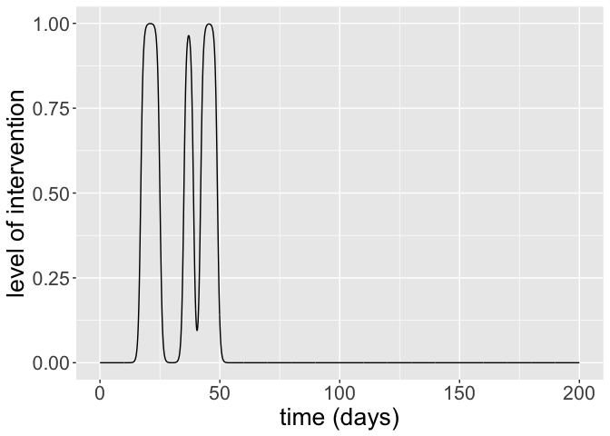
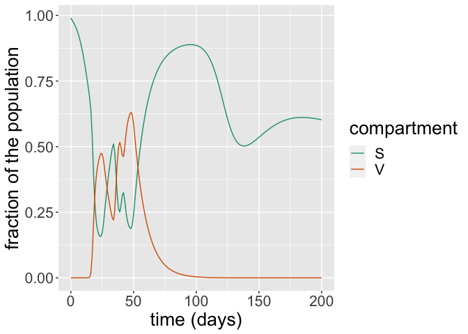
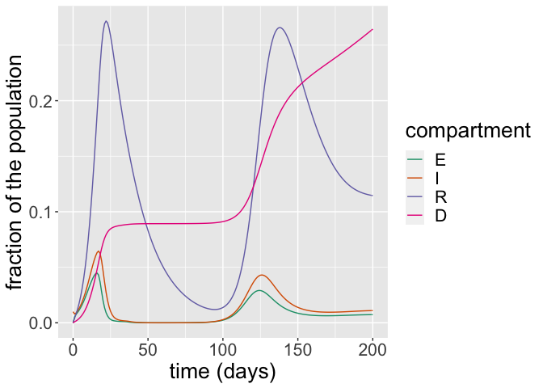
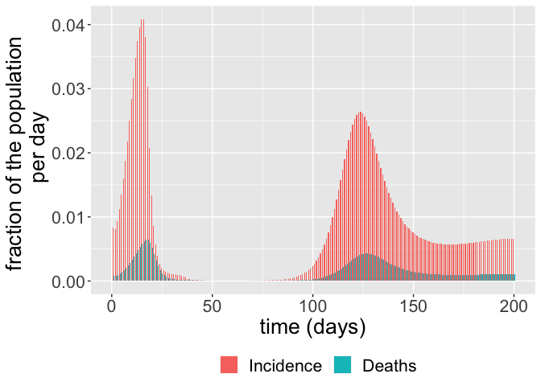
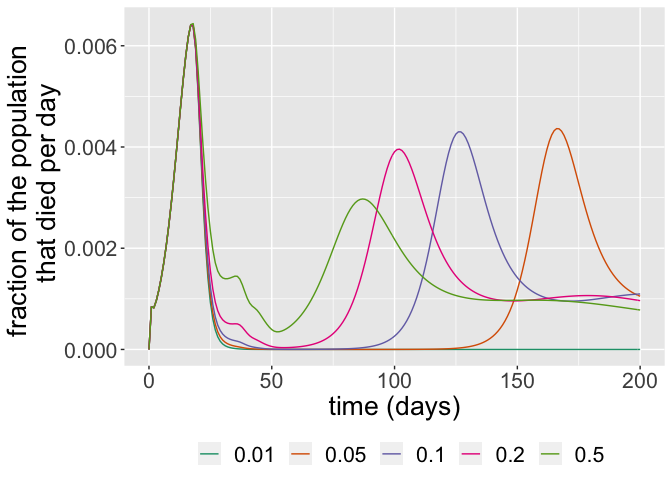
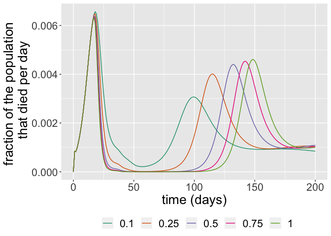
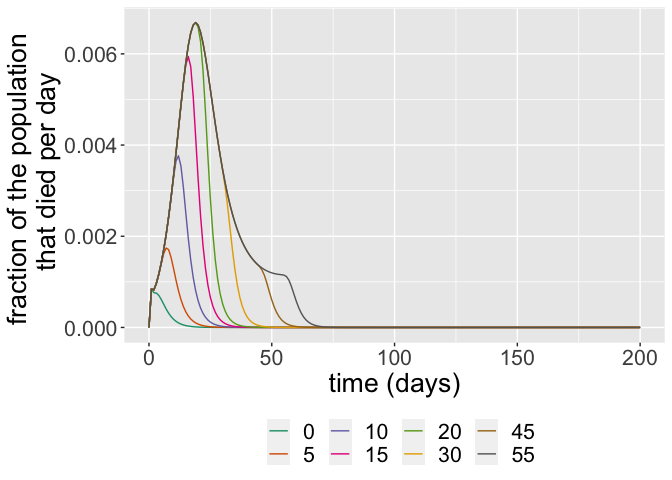

The SEIRDV model
================
Ioana Bouros

``` r
library(comomodels)
library(tidyverse)
#> ── Attaching packages ─────────────────────────────────────── tidyverse 1.3.1 ──
#> ✓ ggplot2 3.3.5     ✓ purrr   0.3.4
#> ✓ tibble  3.1.5     ✓ dplyr   1.0.7
#> ✓ tidyr   1.1.4     ✓ stringr 1.4.0
#> ✓ readr   2.0.2     ✓ forcats 0.5.1
#> ── Conflicts ────────────────────────────────────────── tidyverse_conflicts() ──
#> x dplyr::filter() masks stats::filter()
#> x dplyr::lag()    masks stats::lag()
library(ggplot2)
library(glue)
#> 
#> Attaching package: 'glue'
#> The following object is masked from 'package:dplyr':
#> 
#>     collapse
library(dplyr)
```

## Introduction

This document explains the basics of the SEIRV model. The model
describes how populations of susceptible, exposed, infectious, recovered
and vaccinated individuals evolve over time. Waning immunity is also
considered in this model, so there is a constant supply of susceptibles
in the population which makes the model more realistic.

## The SEIRDV Model

The SEIRDV model consists of five ODEs describing five populations of
susceptible, recovered, infectious, recovered and vaccinated
individuals. Susceptible individuals (*S*) have not been exposed to the
virus. Exposed individuals (*E*) have been exposed to the virus and have
been infected but are not yet infectious to others; they are in the
incubation period. Infectious individuals (*I*) can spread the virus to
others. Recovered individuals (*R*) are no longer infectious, but they
can return to the susceptible population when they lose their immunity.
Vaccinated individuals (*V*) cannot become infected and are not ill at
the time, but as it was the case with the recovered population, their
immunity is temporary and they can become susceptible again with a
certain rate. We can vaccinate not only the susceptibles, but also *E*,
*I* and *R*s. However, they have already been exposed to the illness so
they do not change compartment assignment. Births and deaths unrelated
to the infection are not considered in this model. The ODEs describing
how the five populations evolve over time are
$$\\frac{\\text{d}S}{\\text{d}t} = -\\beta S I - \\nu \\text{Inter}(t) S + \\delta_V V + \\delta_R R,$$
$$\\frac{\\text{d}E}{\\text{d}t} = \\beta S I -\\kappa E,$$
$$\\frac{\\text{d}I}{\\text{d}t} = \\kappa E - (\\gamma + \\mu) I,$$
$$\\frac{\\text{d}R}{\\text{d}t} = \\gamma I - \\delta_R R,$$
$$\\frac{\\text{d}V}{\\text{d}t} = \\nu Inter(t) S - \\delta_V V$$
where *β*, *κ*, *γ*, *μ*, *ν*, *δ*<sub>*V*</sub> and *δ*<sub>*R*</sub>
are positive parameters. The rate at which susceptible individuals are
infected depends on the fraction of the population that is susceptible,
the fraction of the population that is infectious, and the odds of an
infectious individual infecting a susceptible individual, *β*. This is
represented in the first terms on the right-hand side of d*S*/d*t* and
d*E*/d*t*. Exposed individuals become infectious at rate *κ*. 1/*κ* is
the incubation time of the virus, i.e. how many days after exposure the
individual becomes infectious to others. Infectious individuals can
either recover or die because of the disease. Infectious individuals
recover in 1/*γ* days, thus individuals recover at rate *γ*. Similarly,
infectious individuals die due to the infection after 1/*μ* days, making
the death rate *μ*. Susceptible individuals are vaccinated at a maximum
rate *ν*. Among those who are immune (recovered and vaccinated), people
lose their immunity against the virus at different rates depending on
what type of immunity they acquired: *δ*<sub>*V*</sub> for those
vaccinated and *δ*<sub>*R*</sub> respectively for those previously
infected. *I**n**t**e**r*(*t*) is the value at time t of the
intervention protocol defined by the intervention parameters.

In addition to these five main ODEs, the model also keeps track of the
cumulative number of cases (*C*) and the cumulative number of
disease-related deaths (*D*) over time
$$\\frac{\\text{d}C}{\\text{d}t} = \\beta S I,$$
$$\\frac{\\text{d}D}{\\text{d}t} = \\mu I.$$

The system is closed by specifying the initial conditions
*S*(0) = *S*<sub>0</sub>, *E*(0) = *E*<sub>0</sub>, *I*(0) = *I*<sub>0</sub>, *R*(0) = *R*<sub>0</sub>, *V*(0) = *V*<sub>0</sub>, *C*(0) = 0, *D*(0) = 0.
In the implementation of the model in this package, the variables are
normalized so
*S*(*t*) + *E*(*t*) + *I*(*t*) + *R*(*t*) + *V*(*t*) + *D*(*t*) ≡ 1 for
any given *t*. This means that each of these state variables represents
the fraction of the population in each of these states at a given point
in time.

We next illustrate how this model works using functionality available in
`comomodels`.

## The `SEIRDV` class

We first create an `SEIRDV` object that we will use to run simulations.

``` r
my_model <- SEIRDV()
```

Next, we set the parameter values for *β*, *κ*, *γ*, *μ*, *ν*,
*δ*<sub>*V*</sub> and *δ*<sub>*R*</sub>:

``` r
params <- list(beta=1, kappa=0.9, gamma=0.5, mu=0.1, nu=0.4, delta_V=0.1,
               delta_R=0.05)
transmission_parameters(my_model) <- params
```

To check that the parameters have been set correctly, we call

``` r
transmission_parameters(my_model)
#> $beta
#> [1] 1
#> 
#> $kappa
#> [1] 0.9
#> 
#> $gamma
#> [1] 0.5
#> 
#> $mu
#> [1] 0.1
#> 
#> $nu
#> [1] 0.4
#> 
#> $delta_V
#> [1] 0.1
#> 
#> $delta_R
#> [1] 0.05
```

We now need to set the initial conditions for the model. We only set the
initial conditions *S*(0), *E*(0), *I*(0), *R*(0) and *V*(0).

``` r
initial_conditions(my_model) <- list(S0=0.99, E0=0, I0=0.01, R0=0, V0=0)
```

The initial conditions must sum to one. If they do not, an error is
thrown.

Now we simulate the system from *t* = 0 days to *t* = 200 days.

``` r
intervention_parameters(my_model) <- list(starts=c(17, 35, 42),
                                          stops=c(25, 39, 49),
                                          coverages=c(1, 1, 1))
times <- seq(0, 200, by = 1)
out_df <- run(my_model, times)
```

The added intervention feature allows for variable levels of vaccination
in a population. In most cases, a vaccine is not available or considered
necessary right from the start of an epidemic so there is a delay in
vaccination. Similarly, vaccination programs may not run at the same
rate all the time, so such fluctuations need to be taken into account in
our modeling.

Below we can see a plot of the level of interventions that occur at each
time step.

``` r
int_parms <- InterventionParameters(start=c(17, 35, 42),
                                    stop=c(25, 39, 49),
                                    coverage=c(1, 1, 1))

sim_parms <- SimulationParameters(start=0, stop=200, tstep = 0.1)

intervention_protocol(int_parms, sim_parms, 1) %>%
  ggplot(aes(x=time, y=coverage)) +
  geom_line() +
  scale_color_brewer(palette = "Dark2") +
  labs(x = "time (days)", y = "level of intervention") +
  theme(text = element_text(size = 20))
```

<!-- --> Interventions
for this model last several days at least and have several days between
them.

The simulation returns two objects: one is a data frame comprising the
states over time. Here, the infectious proportion is steadily declining,
plummeting to 0 after *t* = 20.

``` r
states <- out_df$states

sv <- subset(states, states$compartment %in% c("S", "V"))
ggplot(sv, aes(x = time, y = value)) +
  geom_line(aes(color = compartment)) +
  scale_color_brewer(palette = "Dark2") +
  labs(x = "time (days)", y = "fraction of the population") +
  theme(text = element_text(size = 20))    
```

<!-- -->

``` r
eird <- subset(states, !states$compartment %in% c("S", "V"))
ggplot(eird, aes(x = time, y = value)) +
  geom_line(aes(color = compartment)) +
  scale_color_brewer(palette = "Dark2") +
  labs(x = "time (days)", y = "fraction of the population") +
  theme(text = element_text(size = 20))    
```

<!-- -->

The simulation also outputs incidence and deaths. These are derived from
the state variables. Incidence is just the difference between the
cumulative number of cases between two time points,

incidence(t) = *C*(*t*) − *C*(*t*−1),

since this shows the number of cases which have arisen between these
time points. Deaths are also given by a difference, but, in this
instance, between the cumulative number of deaths at two consecutive
time points:

deaths(t) = *D*(*t*) − *D*(*t*−1).

``` r
changes <- out_df$changes

ggplot(changes, aes(x = time, y = value, fill = compartment)) +
  geom_bar(stat="identity", position = position_dodge()) +
  scale_color_brewer(palette = "Dark2") +
  labs(x = "time (days)", y = "fraction of the population \n per day") +
  theme(legend.position = "bottom", legend.title = element_blank(),
        text = element_text(size = 20))
```

<!-- -->

## Sensitivity analysis

In this section, we investigate the sensitivity of the number of deaths
to the loss-of-immunity rate in vaccinated individuals,
*δ*<sub>*V*</sub>. We run the model for varying values of
*δ*<sub>*V*</sub> and plot the number of deaths per day over time.

``` r
# function to setup and run model for different delta_V values
run_seirdv <- function(delta_V_val) {
  inits <- list(S0=0.99, E0=0, I0=0.01, R0=0, V0=0)
  params <- list(beta=1, kappa=0.9, gamma=0.5, mu=0.1, nu=0.4, delta_V=delta_V_val,
                 delta_R=0.05)
  interv<- list(starts=c(17, 35, 42),
                stops=c(25, 39, 49),
                coverages=c(1, 1, 1))
  model <- SEIRDV(initial_conditions = inits,
                transmission_parameters=params,
                intervention_parameters = interv)
  times <- seq(0, 200, by = 1)
  out_df <- run(model, times)
  out_df$changes
}

# run model across different delta_V values
delta_V_vals <- c(0.1, 0.05, 0.01, 0.2, 0.5)
for(i in seq_along(delta_V_vals)) {
  delta_V_temp <- delta_V_vals[i]
  temp <- run_seirdv(delta_V_temp) %>% mutate(delta_V=delta_V_temp)
  if(i == 1)
    result <- temp %>% mutate(delta_V=delta_V_temp)
  else
    result <- result %>% bind_rows(temp)
}

# plot results
result %>% 
  filter(compartment=="Deaths") %>% 
  ggplot(aes(x=time, y=value, color = as.factor(delta_V))) +
  geom_line(stat = "identity", position = position_dodge()) +
  scale_color_brewer(palette = "Dark2") +
  labs(x = "time (days)", y = "fraction of the population \n that died per day") +
  theme(legend.position = "bottom", legend.title = element_blank(),
        text=element_text(size=20))
#> Warning: Width not defined. Set with `position_dodge(width = ?)`
```

<!-- --> As we can see
from the plot above, larger rates of immunity decay *δ*<sub>*V*</sub> in
vaccinated individuals make the second wave of the number of deaths in
the epidemic occur much closer to the first peak. For smaller
*δ*<sub>*V*</sub>, we see no deaths for larger stretches of time.

We now investigate the sensitivity of the number of deaths to the
maximum vaccination rate, *ν*. We run the model for varying values of
*ν* and plot the number of deaths per day over time.

``` r
# function to setup and run model for different nu values
run_seirdv <- function(nu_val) {
  inits <- list(S0=0.99, E0=0, I0=0.01, R0=0, V0=0)
  params <- list(beta=1, kappa=0.9, gamma=0.5, mu=0.1, nu=nu_val, delta_V=0.1,
                 delta_R=0.05)
  interv<- list(starts=c(17, 35, 42),
                stops=c(25, 39, 49),
                coverages=c(1, 1, 1))
  model <- SEIRDV(initial_conditions = inits,
                transmission_parameters=params,
                intervention_parameters = interv)
  times <- seq(0, 200, by = 1)
  out_df <- run(model, times)
  out_df$changes
}

# run model across different nu values
nu_vals <- c(0.1, 0.25, 0.5, 0.75, 1)
for(i in seq_along(nu_vals)) {
  nu_temp <- nu_vals[i]
  temp <- run_seirdv(nu_temp) %>% mutate(nu=nu_temp)
  if(i == 1)
    result <- temp %>% mutate(nu=nu_temp)
  else
    result <- result %>% bind_rows(temp)
}

# plot results
result %>% 
  filter(compartment=="Deaths") %>% 
  ggplot(aes(x=time, y=value, color = as.factor(nu))) +
  geom_line(stat = "identity", position = position_dodge()) +
  scale_color_brewer(palette = "Dark2") +
  labs(x = "time (days)", y = "fraction of the population \n that died per day") +
  theme(legend.position = "bottom", legend.title = element_blank(),
        text=element_text(size=20))
#> Warning: Width not defined. Set with `position_dodge(width = ?)`
```

<!-- --> As we can
see from the plot above, larger rates of maximum vaccination *ν* make
the second wave of the number of deaths in the epidemic occur much
further to the first peak. For larger *ν*, we see no deaths for larger
stretches of time, even though the second peak is larger.

We now investigate the sensitivity of the start time of intervention
values, `start_val`. We run the model for varying values of `start_val`
and plot the number of deaths per day over time.

For this investigation, we are switching to a new intervention that
starts at start_val and continues to 100, rather than the one you’ve
been using previously

``` r
# function to setup and run model for different start intervention values
run_seirdv <- function(start_val) {
  inits <- list(S0=0.99, E0=0, I0=0.01, R0=0, V0=0)
  params <- list(beta=1, kappa=0.9, gamma=0.5, mu=0.1, nu=0.4, delta_V=0.1,
                 delta_R=0.05)
  interv<- list(starts=start_val,
                stops=100,
                coverages=1)
  model <- SEIRDV(initial_conditions = inits,
                transmission_parameters=params,
                intervention_parameters = interv)
  times <- seq(0, 200, by = 1)
  out_df <- run(model, times)
  out_df$changes
}

# run model across different start_val values
start_val <- c(0, 5, 10, 15, 20, 30, 45, 55)
for(i in seq_along(start_val)) {
  start_temp <- start_val[i]
  temp <- run_seirdv(start_temp) %>% mutate(starts=start_temp)
  if(i == 1)
    result <- temp %>% mutate(starts=start_temp)
  else
    result <- result %>% bind_rows(temp)
}

# plot results
result %>% 
  filter(compartment=="Deaths") %>% 
  ggplot(aes(x=time, y=value, color = as.factor(starts))) +
  geom_line(stat = "identity", position = position_dodge()) +
  scale_color_brewer(palette = "Dark2") +
  labs(x = "time (days)", y = "fraction of the population \n that died per day") +
  theme(legend.position = "bottom", legend.title = element_blank(),
        text=element_text(size=20))
#> Warning: Width not defined. Set with `position_dodge(width = ?)`
```

<!-- --> As we can
see from the plot above, larger start time of intervention values,
`start_val` produces deaths for much longer and the peak of their number
is higher than in the case of smaller `start_val`.
